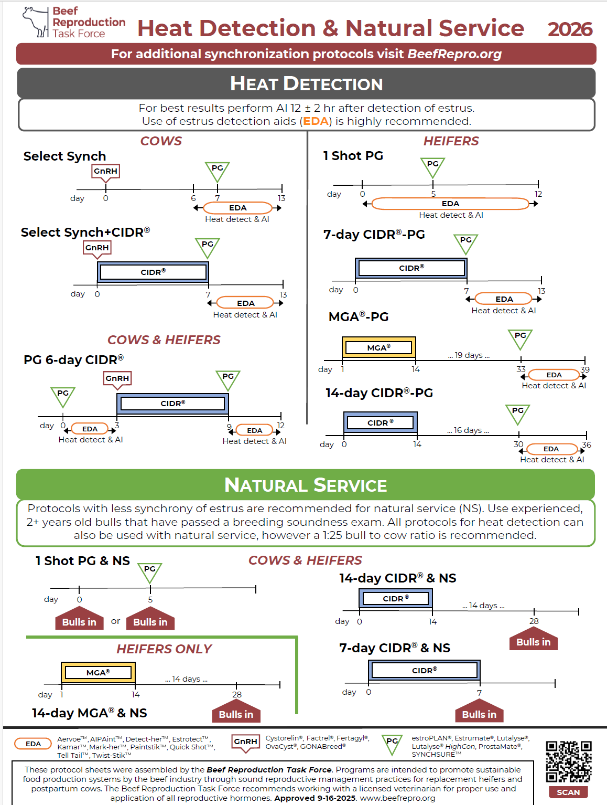

The Beef Reproduction Task Force's 2026 **Heat Detection & Natural Service** synchronization protocols. Tap the image or the button below to open or download the full-size PDF.

::: text-center

:::

::: text-center
<a href="images/repro-protocols-2026.pdf"
   class="btn btn-lg btn-accent"
   download="2026-Heat-Detection-and-Natural-Service-Protocols.pdf">Download the protocol sheet (PDF)</a>
<a href="https://beefrepro.org/" class="btn btn-lg btn-info" target="_blank" rel="noopener">Visit BeefRepro.org</a>
:::
