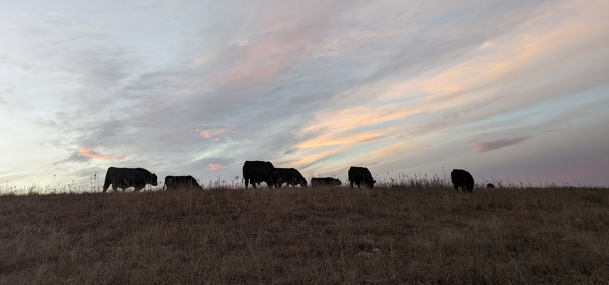

## Repro Protocols

Visit the Beef Reproduction Task Force for current repro protocols.

::: text-center
<a href="https://beefrepro.org/" class="btn btn-lg btn-info" target="_blank" rel="noopener">Visit BeefRepro.org</a>
:::

  

