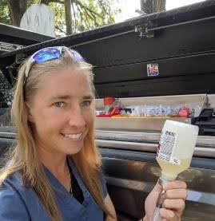
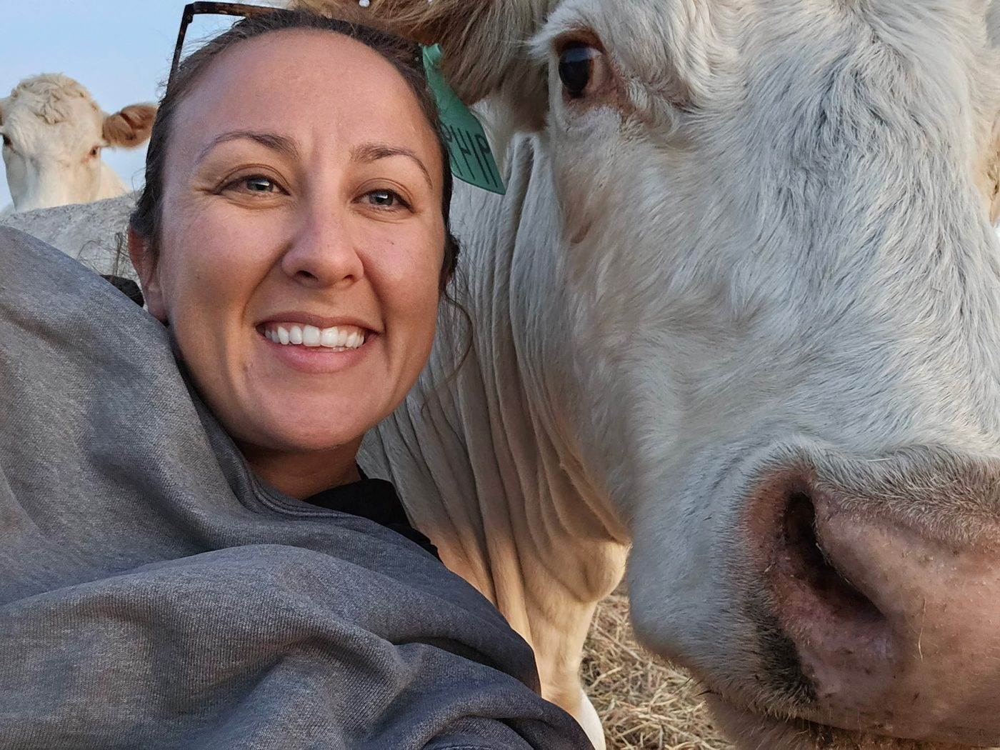
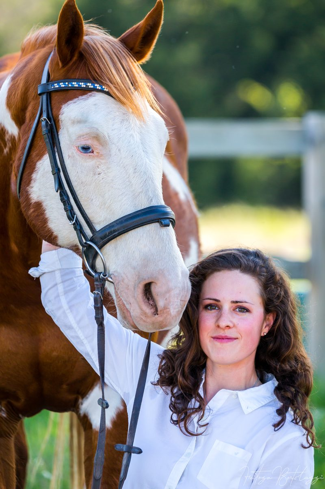

{width="110"} **Dr. Nora Schrag**

Nora Schrag received her DVM from Kansas State University in 2006, and then spent her first year of practice in the Chaco region of Paraguay.  For the next 6 years she enjoyed rural mixed animal practice in southeast Nebraska.  She then returned to Kansas State College of Veterinary Medicine to teach livestock field services.  This position eventually transitioned into doing research, a PhD, and board certification in clinical pharmacology (Dip. ACVCP).  Nora enjoys the challenge of applying research within the real world of clinical practice.  Her time is split between practice in the flint hills of Kansas and doing data analytics for a variety of veterinary related projects.

{width="100"} **Dr. Tara Fountain**

Dr. Tara Fountain is from central Missouri where she grew up on a cow-calf operation. She graduated from Kansas State University in 2014 with a Bachelors of Animal Sciences and Industry.  In 2020, she graduated from  Kansas State University College of Veterinary Medicine, and completed her masters degree in Veterinary Biomedical Sciences. After graduation, she practiced in Concordia, KS at a mixed animal veterinary clinic before moving back to the Randolph area. She has most recently been working in a small animal veterinary clinic in Manhattan, but is excited for the opportunity to work in a mixed animal setting again. She and her husband,Nick, live near Randolph with their daughter, Raya. Together they operate a seedstock Charolais and Angus operation.

{width="100"} **Kristen Dunivan**

Kristen graduated with a Masters in Veterinary Clinical Sciences from Kansas State University in 2022. She completed her bachelors in Animal Science at Kansas State University in 2020, she spent 3 years during undergrad working at the Beef Cattle Research Center as well as a summer at the Dairy. She grew up with horses and now manages a horse boarding facility in Randolph, KS. Kristen is passionate about improving animal health and welfare through data analysis and evidence-based practices. She proudly holds the title of "Sidekick" to Dr. Schrag, and is excited to be a part of the Livestock Vet Resource team.

