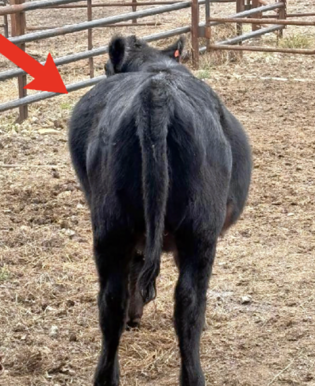

## Overview

Bloat occurs when gas produced during digestion becomes trapped in the rumen, causing distension of the abdomen. It can develop quickly and become life-threatening without intervention.

::::: columns
::: {.column width="60%"}
## Signs

- Visible distension on the left side of the abdomen
- Discomfort, kicking at the belly
- Labored breathing
- Reluctance to move
:::

::: {.column width="40%"}
{width="50%"}
:::
:::::

### Free-Gas Bloat

- Relieve gas pressure with tube
- Give Banamine
- If it has a fever treat with Nuflor
- Feed only prairie hay for at least 12 hours

If it bloats again or doesn't go down when tubed, call for help.

::: callout-warning
Severe bloat can be fatal within hours. If an animal shows significant distension or difficulty breathing, contact LVR immediately.
:::

## Prevention

- Introduce cattle to lush pasture gradually
- Provide adequate dry hay/roughage before turnout onto legume-heavy pasture

Contact us with questions and for more information!
