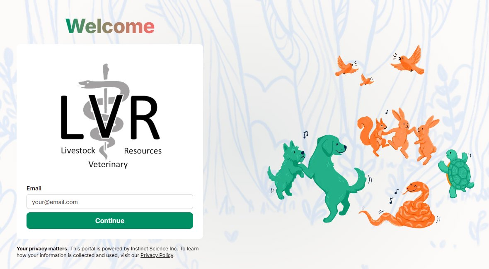

::::::: columns
::::: {.column width="60%"}
## Access Your Client Portal

Our online client portal gives you secure, anytime access to your herd's medical records with LVR.

### What you can do in the portal

- Access your herd's medical records and treatment history
- View VFDs, health papers, and visit history

### Logging in

1.  Click the **Client Portal** button below.
2.  Enter the email on file with our clinic.
3.  You will be sent a login link to your email.
4.  Once logged in, you'll see your medical records, VFDs, health papers, visit history and more.

::: callout-note
If you don't see your records after logging in, or you're having trouble accessing the portal, please call us at [(785) 333-8384](tel:+17853338384) and we'll get you set up.
:::

::: text-center
<a href="https://lvr.portal.instinctvet.com"
   class="btn btn-lg btn-info w-100"
   target="_blank"
   rel="noopener"> Go to Client Portal </a>
:::
:::::

::: {.column width="40%"}
{style="border-radius:8px; border:1px solid #eef1f5;" width="100%"}
:::
:::::::
