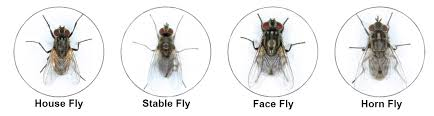

{fig-align="center" width="388"}

## Quick Reference

| Fly Type | What to Look For | Best Control |
|---|---|---|
| **Horn Flies** | Small (3–5mm), gather on the back and sides, bite and feed on blood | Ear tags, pour-ons, back rubbers/dust bags |
| **Face Flies** | Dark gray, 6–8mm, non-biting but spread pinkeye, gather near eyes, nose, and wounds | Pyrethroid ear tags, pour-ons, back rubbers/dust bags |
| **Stable Flies** | Gray checkerboard pattern, 7–8mm, bite and feed on blood, gather on legs, active mid-May–September | Sanitation, premise spraying |

:::::: {layout-ncol="3"}
::: column-content-1
### Horn Flies

**What to look for:** Small flies (3–5mm) that gather on the back and sides of cattle and bite and feed on blood.

**Control:**

-   Ear tags — remove in the fall to help prevent resistance
-   Pour-ons like ivermectin — protect for about 28 days, so reapply as needed
-   Back rubbers and dust bags — let cattle treat themselves, no handling required
-   Oral larvicides in feed or mineral — stop new larvae but don't kill adult flies
:::

::: column-content-2
### Face Flies

**What to look for:** Dark gray flies (6–8mm) that don't bite but spread pinkeye. They gather around the eyes, nose, and wounds.

**Control:**

-   Pyrethroid ear tags
-   Pour-ons
-   Back rubbers and dust bags — let cattle treat themselves, no handling required
:::

::: column-content-3
### Stable Flies

**What to look for:** Gray flies with a checkerboard pattern (7–8mm) that bite and feed on blood, usually on the legs. Most common mid-May through September.

**Control:**

-   Sanitation — remove manure piles and other larvae breeding sites (most effective option)
-   Premise spraying — flies rest in shaded areas, so treating those spots can help
:::
::::::

## Recommended Products

:::: columns
::: {.column width="33%"}
::: lvr-card
### Cyonara

**Type:** Pour-on

FliesTicks

Applied along the topline, Cyonara is our recommended pour-on for fly and tick control.
:::
:::

::: {.column width="33%"}
::: lvr-card
### Corathon

**Type:** Spray

FliesTicks

Can be sprayed directly on ears and sores for targeted fly and tick control.
:::
:::

::: {.column width="33%"}
::: lvr-card
### Permethrin 10%

**Type:** Fogger

FliesTicks

Used in a fogger for premise treatment to help knock down adult fly and tick populations.
:::
:::
::::
