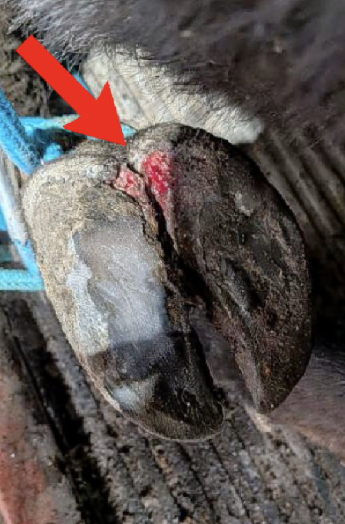
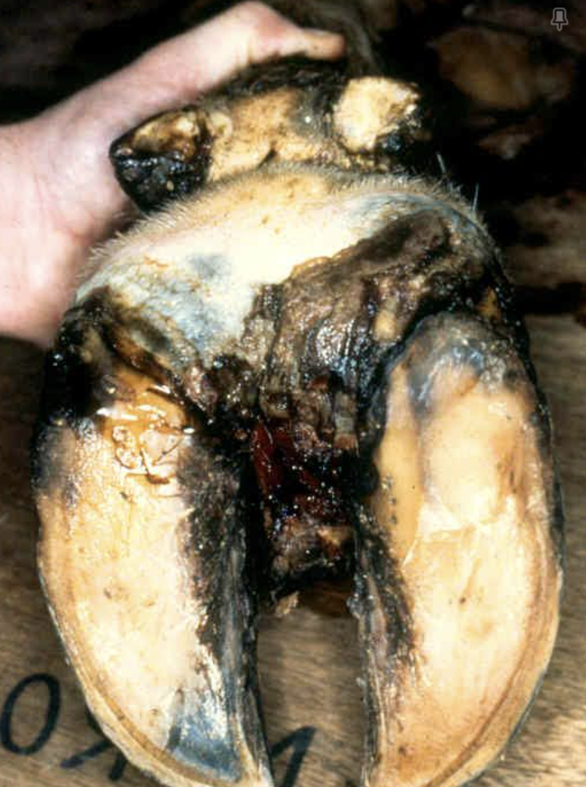

## Overview

Both hairy heel wart (digital dermatitis) and footrot are common causes
of lameness in cattle, but they have different causes and require
different treatment approaches.

## Hairy Heel Wart (Digital Dermatitis)

- A bacterial skin infection, typically on the back of the heel near the
  skin-hoof junction.
- Appears right at the hair line as a raw, raspberry-like or
  hairy/wart-like lesion.
- No swelling, often pointing toes.
- Highly contagious within a herd.

**Management:**

- Topical antibiotic treatment directly on the lesion
- Footbaths to reduce herd-wide spread
- Improving pen/lot drainage and reducing standing manure/mud

{fig-align="right" width="253"}

## Footrot

- A bacterial infection of the soft tissue between the toes, usually
  following a break in the skin (cuts, abrasions, abscess sites).
- Entire foot is swollen not just one side.
- Generally affects one animal at a time rather than spreading rapidly
  like digital dermatitis.

**Management:**

- Systemic antibiotic treatment (not just topical)
- Expect significant improvement within 2 days, if not call us.
- Keeping the area clean and dry during recovery
- Addressing environmental factors (rocks, debris, wet lots) that cause the initial injury

{fig-align="right"
width="266"}

::: callout-note
If lameness doesn't improve within a few days of treatment for footrot
or 2 weeks for heel wart, or if you're unsure which condition you're
dealing with, give us a call.
:::

Contact us with questions and for more information!
