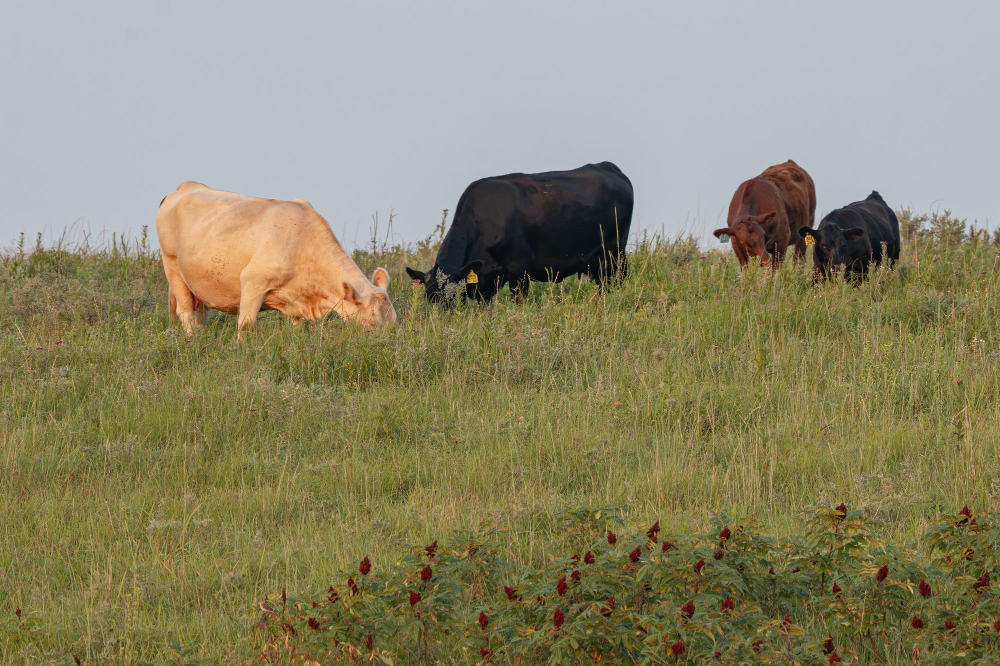

::: lvr-hero
{.lvr-hero-bg fig-alt="Cattle grazing a green ridge in the Kansas Flint Hills"}

::: lvr-hero-inner
# Veterinary services & data analytics

::: lvr-hero-sub
Flint Hills of Kansas
:::

[Client tools](#client-tools){.btn .btn-lg}
[Contact](#contact){.btn .btn-lg .btn-accent}
:::
:::

**Clinical veterinary services:** LVR partners with clients to improve herd health by providing production data analytics and mobile large animal clinical veterinary services to select clients near Olsburg, KS.

**Research:** LVR participates in contract research projects which improve livestock health by supporting policy change and product development.

## Client tools {#client-tools}

:::: {.grid}

::: {.g-col-12 .g-col-md-6 .g-col-lg-4}
<a class="lvr-tool lvr-tool-feature" href="health_records/sick_calf/">
New
Sick Calf Exam
Exam beside the calf; text the clinic.
Open &rarr;
</a>
:::

::: {.g-col-12 .g-col-md-6 .g-col-lg-4}
<a class="lvr-tool" href="CalfHydrationCR.html">
Calf Hydration &amp; Colostrum
Hydration &amp; colostrum guidance.
Open &rarr;
</a>
:::

::: {.g-col-12 .g-col-md-6 .g-col-lg-4}
<a class="lvr-tool" href="Webdosechart.html">
Dosage Chart
Drug dosing by weight.
Open &rarr;
</a>
:::

::: {.g-col-12 .g-col-md-6 .g-col-lg-4}
<a class="lvr-tool" href="vaccinereccomendations.html">
Vaccine Recommendations
Protocols &amp; timing.
Open &rarr;
</a>
:::

::: {.g-col-12 .g-col-md-6 .g-col-lg-4}
<a class="lvr-tool" href="calving.html">
Calving
Calving-season reference.
Open &rarr;
</a>
:::

::: {.g-col-12 .g-col-md-6 .g-col-lg-4}
<a class="lvr-tool" href="flyinformation.html">
Fly Information
Identify &amp; manage flies.
Open &rarr;
</a>
:::

::::

::: {#contact .lvr-contact-card}
**Dr. Nora Schrag and Dr. Tara Fountain**

Phone: [(785) 333-8384](tel:+17853338384)

We look forward to hearing from you!
:::

Want to learn more about Dr. Schrag, Dr. Fountain, and Kristen first? Visit our [About page](about.qmd).
