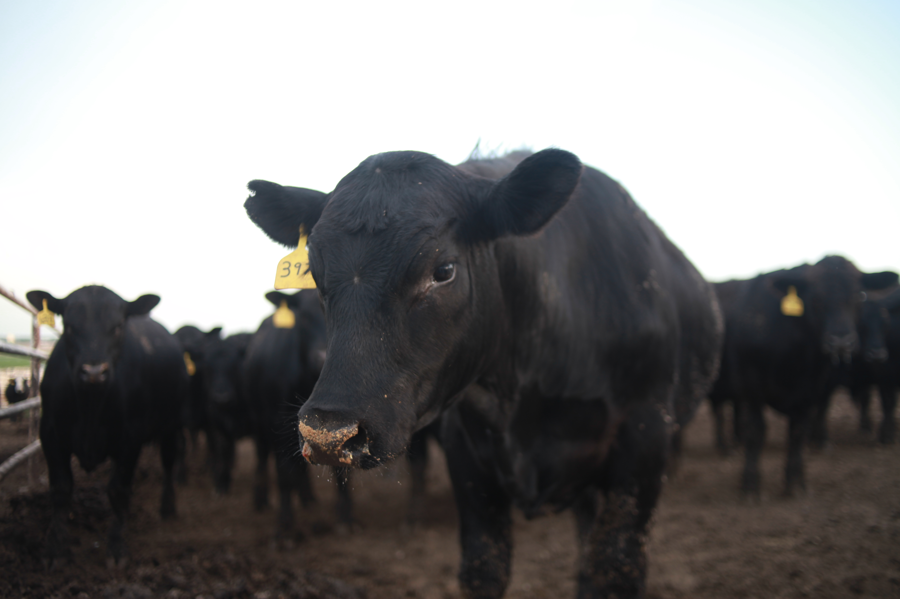
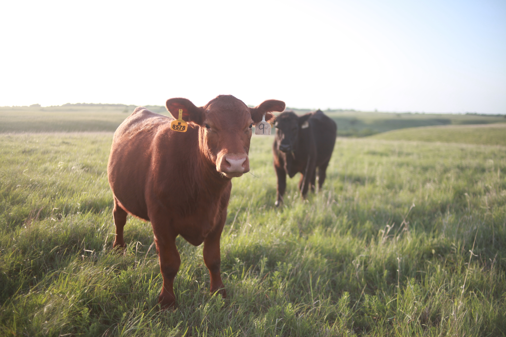
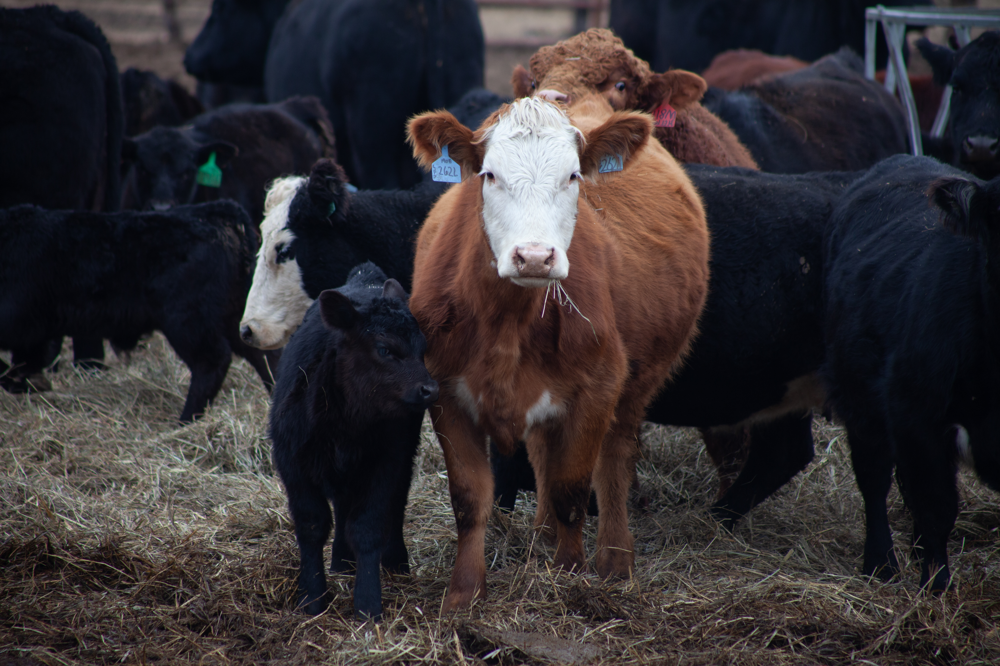
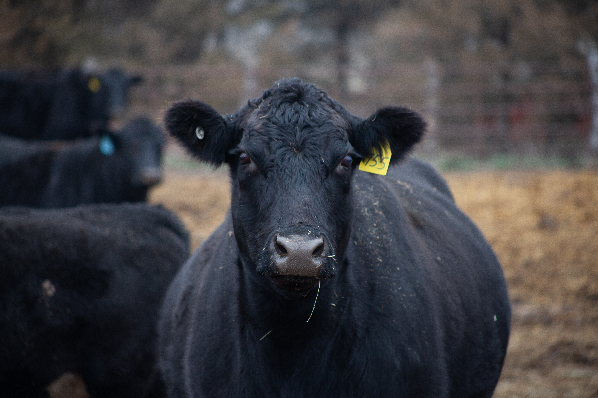

---
title: "Livestock Veterinary Resources"
page-layout: full
---

**Clinical Veterinary Services:** LVR partners with clients to improve herd health by providing production data analytics and mobile large animal clinical veterinary services to select clients near Olsburg, KS.

**Research:** LVR participates in contract research projects which improve livestock health by supporting policy change and product development.

::: lvr-hero-slideshow

:::

::: lvr-contact-card
**Dr. Nora Schrag and Dr. Tara Fountain**

Phone: (785) 333-8384

Email: LivestockVets\@gmail.com

We look forward to hearing from you!
:::

Want to learn more about Dr. Schrag, Dr. Fountain, and Kristen first? Visit our [About page](about.qmd).