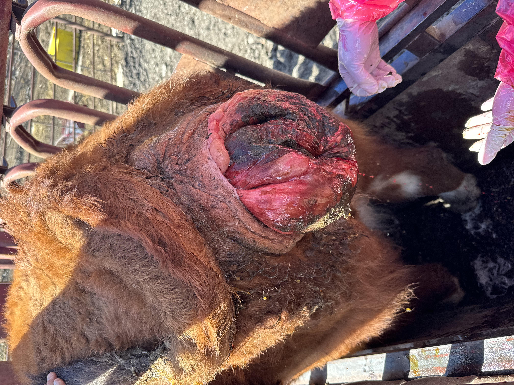
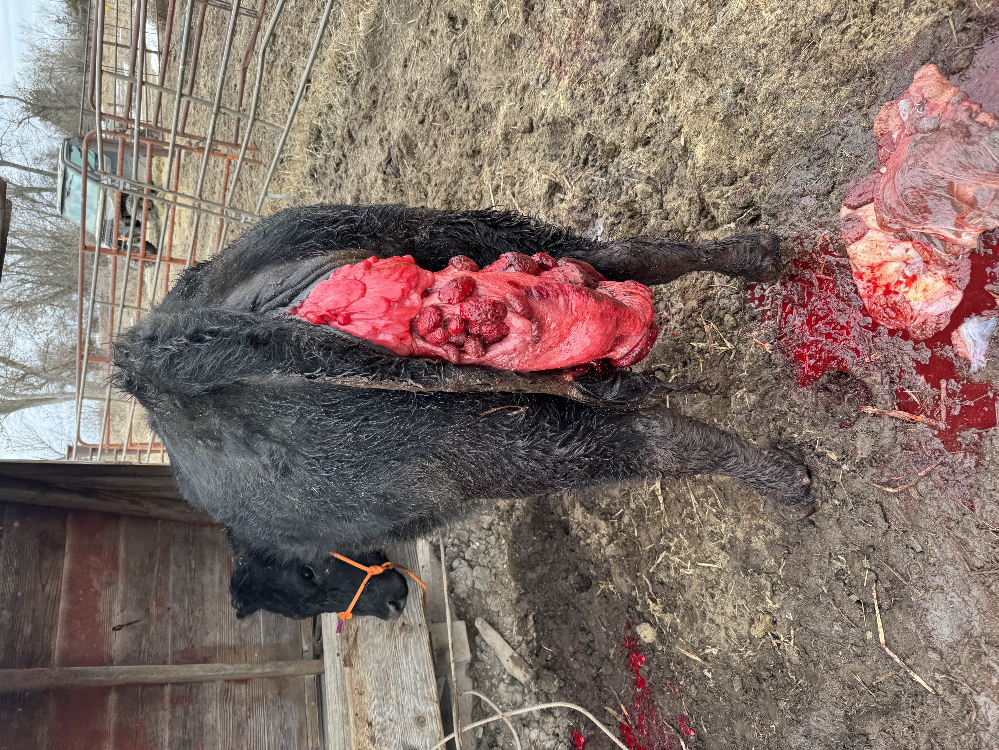
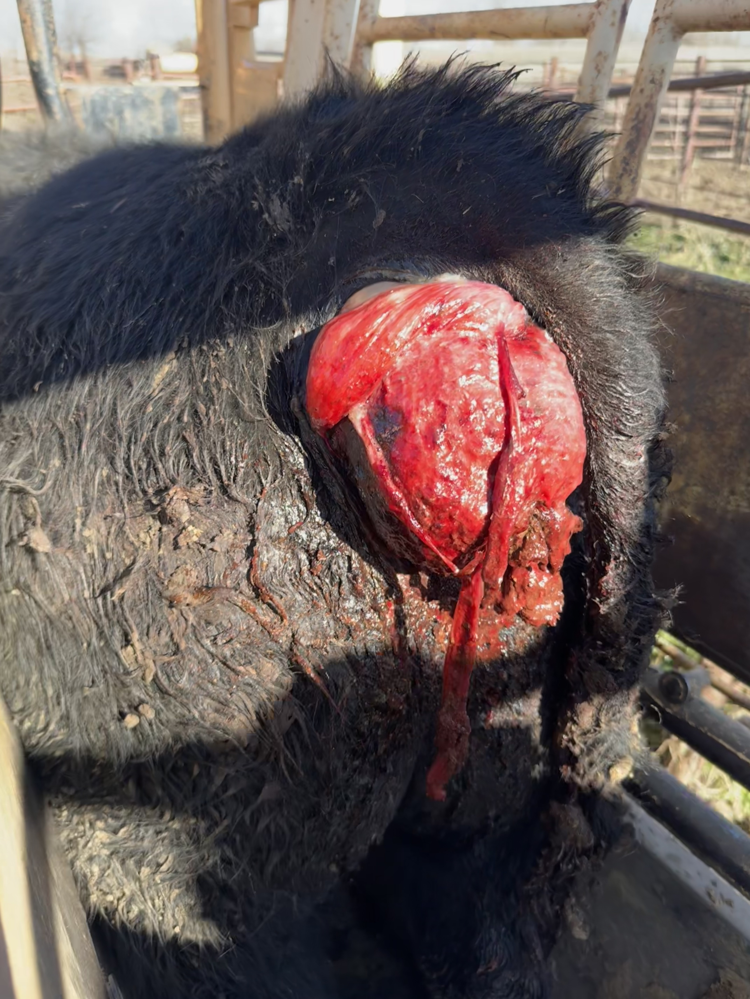

## Types

### Vaginal Prolapse

- Typically occurs in late pregnancy, before calving.
- Tissue protrudes intermittently at first, often worsening over time.
- {width="160"}

### Uterine Prolapse

- Occurs shortly after calving, when the uterus turns inside out and passes through the vulva.
- This is an emergency — contact us immediately.
- Have her tied to something (Tree, tractor, contained somehow) by the time we get there.
- {width="162"}

### Rectal Prolapse

- Tissue from the rectum protrudes through the anus.
- Can be associated with straining, coughing, or other underlying conditions.
- {width="164"}

::: callout-warning
Any prolapse should be treated. Contact LVR right away if you notice a prolapse in your herd.
:::

Contact us with questions and for more information!
