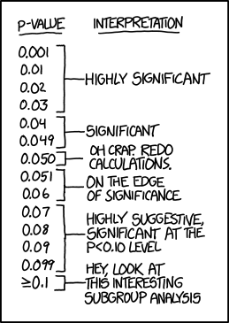

::: callout-warning
Do NOT use this page unless you understand the limitations of these calculations, and when they do not apply.
:::

::: {style="display: flex; justify-content: center; flex-wrap: wrap; gap: 10px;"}
<a href="https://lvr-explore.shinyapps.io/ShinyCIforProportion/" class="btn btn-lg btn-info">CI for Proportions</a>

<a href="https://lvr-explore.shinyapps.io/PropUncertainty/" class="btn btn-lg btn-info">Proportional Uncertainty</a>

<a href="https://lvr-explore.shinyapps.io/Power_Curves_Binomial_Prop/" class="btn btn-lg btn-info">Power Curves</a>
:::

{fig-align="center"}

[Source: ExplainXKCD](https://www.explainxkcd.com/wiki/index.php/2048:_Curve-Fitting)
